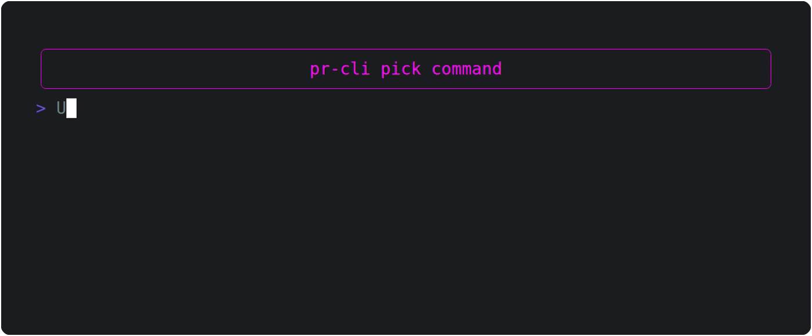

# PR-CLI

Pull Request - Command Line Interface

## ✨ Functionality

### Picking commits (`pr-cli pick`)

Quickly cherry-pick one or more commits from your current branch onto a new one and create a pull
request for these commits.

Very useful when doing a quick bugfix/cleanup/change unrelated to your branch. Or when creating
frequent, small commits.

- No need to leave your current branch!
- Uncommitted changes are not a problem, no need to stash

> pr-cli achieves this by creating a new worktree in a temporary directory, so that your main
> worktree is completely unaffected

- Interactive settings / confirmation screen

It also has all the PR title/body features of [`pr-cli pr`](#creating-a-pull-request-pr-cli-pr)

#### Usage

1. Run `pr-cli pick` (or `pr-cli p`) in a git repository
2. Choose the commits you want to pick (If there is more than one)
3. Choose how to set the pull request title (will also be used as branch name)
4. Confirm/Change settings
5. Press Enter to create Pull Request

### Creating a pull request (`pr-cli pr`)

Create a GitHub pull request based on your current branch, like `gh pr create` but better.

- Quick options for setting the PR title
  - Use one of the commit's titles
  - Use the branch name
  - Type a custom one
- Automatically generate PR body based on all commits

### Demo



## 📥 Installation

- Install prerequisites:
  > ℹ️ Check if you already have these installed by running `deno --version` and `gh --version`
  - Deno: https://deno.land/manual/getting_started/installation
  - GitHub CLI: https://github.com/cli/cli#installation
- Install pr-cli:

  ```shell
  deno install --global --name pr-cli --allow-run --allow-read --allow-env https://deno.land/x/prcli/main.ts
  ```
<details>
	<summary>Installing from a local checkout</summary>

 	Installing from a local checkout of this repository requires specifying `--config=deno.json` during installation. (see https://github.com/denoland/deno/issues/26212)


	  ```shell
	  deno install --global --name pr-cli --allow-run --allow-read --allow-env --config=deno.json ./main.ts
	  ```
</details>

- Install Gum:

  ```shell
  pr-cli install-deps
  ```

  > ℹ️ you can also install Gum manually if you prefer:
  > https://github.com/charmbracelet/gum#installation

### ⬆️ Upgrading

To upgrade your installation to the latest version:

```shell
deno install --reload --force --global --name pr-cli --allow-run --allow-read --allow-env https://deno.land/x/prcli/main.ts
```

### 🔲 Completions

Enable auto-completion of pr-cli commands by running the command for your shell:

#### Bash

```shell
echo 'source <(pr-cli completions bash)' >> ~/.bashrc
```

#### ZSH

```shell
echo 'source <(pr-cli completions zsh)' >> ~/.zshrc
```

#### Fish

```shell
echo 'source (pr-cli completions fish | psub)' >> ~/.config/fish/config.fish:
```
